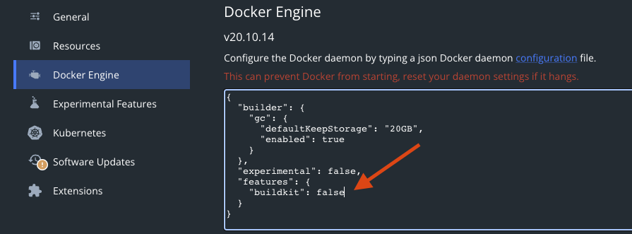
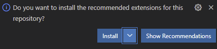
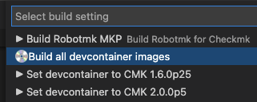

# Development

This page explains step by step how to set up your development environment to debug and develop Robotmk.  
Feel encouraged to contribute code!
## Preconditions

### Docker 

A very basic requirement is [Docker](https://www.docker.com) to run the containers.  
On a Mac M1, you probably have to disable the `buildkit` feature: 



(Also possible for single build tasks with `export DOCKER_BUILDKIT=0`).

### Visual Studio Code

When you open the Robotmk project for the first time in [Visual Studio Code](https://code.visualstudio.com), you will be prompted to install some extensions - which is highly recommended:



### Chag

Robotmk uses [chag](https://raw.githubusercontent.com/mtdowling/chag/master/install.sh) to keep annotated tags and the CHANGELOG in sync. 

Examples: 

* Show entries of a special release: `chag contents --tag v1.0.2`
* Create a Changelog entry for the `Unreleased` section: `chag update 1.0.4`
  
### Github CLI tool 

Authentication to GitHub is required if you want to release/unrelease.

Install the CLI tools from https://github.com/cli/cli.

---

## Development environment setup 

Both flavours of Robotmk (CMK1 and 2) can be developed with Visual Studio Code and the [devcontainer setup](https://code.visualstudio.com/docs/remote/containers). 
### Build Devcontainer images

Open `.devcontainer/build-devcontainer.env` and add all versions of Checkmk you want to develop on to the `CMKVERSIONS` variable. (= All versions are a long quoted string, separated by newlines.)

Example: 

     CMKVERSIONS="1.6.0p29
     2.0.0p22
     2.1.0p4"

- Run *Cmd-Shift-P* and select `Select Task...` > "Build all devcontainer images".
- Run *Cmd-Shift-P* and select `Run Task...` to built the containers. 



What does the task "***Build all devcontainer images***" (`.devcontainer/build-devcontainer.sh`) do? 

- First it checks if the CMK Docker images are already available locally. If not, it connects to the [Checkmk Docker Registry](registry.checkmk.com) and downloads the images from there.
- It then creates a new Docker image based on the CMK docker image (downloaded in step 1) and installs some more things (see `.devcontainer/Dockerfile_cmk_python`):
  - Python 3.9 and modules `robotframework pyyaml mergedeep python-dateutil ipdb`
  - some additional tools: `jq tree htop vim git telnet file lsyncd`

The resulting Docker image is then saved as `robotmk-cmk-python3:2.1.0p4` (example):

     16:04 $ docker images | grep robotmk-cmk
     robotmk-cmk-python3                            2.1.0p4        d1c5971438c3   About a minute ago   2.39GB
     robotmk-cmk-python3                            2.0.0p22       a9c63d994a74   9 minutes ago        2.19GB
     robotmk-cmk-python3                            2.0.0p5        1d96bebf47a6   7 months ago         2.18GB
     robotmk-cmk-python3                            1.6.0p25       599e8beeb9c7   7 months ago         1.93GB
     robotmk-cmk-python3                            2.0.0p4        71bdfccd584b   7 months ago         2.19GB


The Robotmk devcontainers are started on these images. See `.devcontainer/Dockerfile` (which is referenced in `devcontainer.json`):

```
ARG VARIANT
# Build the dev images with .devcontainer/build-devcontainer.sh !
FROM robotmk-cmk-python3:${VARIANT}
...

```

### Set Checkmk versions for task chooser

(Make sure that the extension "tasks-chooser" is installed.)
Now that you have the Docker image versions, you need to add new entries for each specific CMK version in `.vscode/tasks-chooser.json`:

```
{
    "displayName": "▶︎ Set devcontainer to CMK 2.1.0p4",
    "command": "bash .devcontainer/set_devcontainer_version.sh 2.1.0p4"
},
```

### Choose and Start the Checkmk devcontainer

Now it's time to run the container.  
First, set the Checkmk version:

- Run *Cmd-Shift-P* and select `Select Task...` and chose e.g. "*Set devcontainer to CMK 2.1.0p4*" (defined in the previous step)
- Run *Cmd-Shift-P* and select `Run Task...` to run the task. 

This reconfigures some important files:

- `.devcontainer/devcontainer.json` gets *generated* using `envsubst` and the template file in `.devcontainer/v2/devcontainer.json`
- `.vscode/settings.json` and `.vscode/launch.json` get *copied* from the template files in `.vscode/v2/` (controls the python version being used for running and debugging the code)

- Run *Cmd-Shift-P* and select `Remote-Containers: Rebuild Container` to start the devcontainer. 

In the VS Code terminal you see the CMK site starting. 
This takes some minutes (at least on my aged Mac). 
During this step, all relevant files for Robotmk get [lsynced](https://axkibe.github.io/lsyncd/) (V1)/symlinked (V1) into the version specific folder of the CMK Docker container. 

**Don't try to install the Robotmk MKP into this container! All files are already there!** 

If lsyncd is not running, do this by hand: `lsyncd .lsyncd`

The devcontainer is ready now. Open the Checmk login page on http://127.0.0.1:5000

### Select Python Interpreter 

After the devcontainer has started, you probably have to set the python interpreter in VS Code explicitly. 
This is sometimes a little bit unreliable and must be done manually: 

- ensure that `settings.json` do not contain a `python.pythonPath` setting anymore
- Open *Cmd-Shift-P* and run "Select Python Interpreter" for the "robotmk" workspace

### VS Code Build Task

`Ctrl+Shift+B` is bound to `build.sh` which builds the CMK version specific MKP file. 

The resulting MKP can be copied to the host system as follows: 

```
CONTAINER=a596f322c2e8
cd ~/Downloads
docker exec $CONTAINER bash -c "mkdir -p /cmk-mkp; cp /workspaces/robotmk/*.mkp /cmk-mkp"
docker cp $CONTAINER:/cmk-mkp .
```

### Troubleshooting 

#### Devcontainer does not start 

ERROR: The devcontainer does not start; the VS Code `remoteContainers-YYYY-MM-DD` shows: 

     [2022-04-01T13:24:30.960Z] [+] Building 2.5s (3/3) FINISHED                                                
     => [internal] load build definition from Dockerfile                       0.1s
     => => transferring dockerfile: 37B                                        0.0s
     => [internal] load .dockerignore                                          0.0s
     => => transferring context: 2B                                            0.0s
     => ERROR [internal] load metadata for docker.io/library/robotmk-cmk-pyth  2.2s

---

## How to develop

### Write a changelog

Robotmk's [CHANGELOG.md](CHANGELOG.md) is based on [](https://keepachangelog.com/).

All unreleased work must be documented in `CHANGELOG.md` under the `H2` "Unreleased".  
The second line will be the release title.  
All H3's below shoudl group the changes:

     ## Unreleased

     This will be the release title 

     ### Added
     * this 
     * that 
     ### Changed
     * and this (#66)
     ### Fixed
     * and that (fixes #45)
     ### Removed
     * foo
     ### Deprecated    
     * bar
    
  
### Simulating agent output 

Agent output (e.g. from a CMK crash dump) can be injected into the container by placing the output as a file in the folder `agent_output`.

Then create a rule `Individual program call instead of agent access` which uses one of the following commands to source the output file instead of using an agent: 

    	cat ~/var/check_mk/agent_output/$HOSTNAME$
     cat ~/var/check_mk/agent_output/agent_output

### ipdb 

`ipdb` is a great cmdline debugger for Python. In the following example it is shown how to execute the Robotmk check within the cmk context. 
A breakpoint in line 120 is set with "b":  

Debugging the Inventory function:

```
OMD[cmk]:~$ python -m ipdb bin/cmk -IIv test2Win10simdows
> /opt/omd/sites/cmk/bin/cmk(34)<module>()
     33
---> 34 import os
     35 import sys

ipdb> b /omd/sites/cmk/local/share/check_mk/checks/robotmk:120
Breakpoint 1 at /omd/sites/cmk/local/share/check_mk/checks/robotmk:120
ipdb> r
Discovering services on: test2Win10simdows
test2Win10simdows:
+ FETCHING DATA
 [agent] Execute data source
 [piggyback] Execute data source
No piggyback files for 'test2Win10simdows'. Skip processing.
No piggyback files for '192.168.116.8'. Skip processing.
+ EXECUTING DISCOVERY PLUGINS (1751)
ps.perf does not support discovery. Skipping it.
> /omd/sites/cmk/local/share/check_mk/checks/robotmk(120)inventory_robot()
    119 def inventory_robot(robot_items):
1-> 120     robot_service_prefix = get_setting('robot_service_prefix',[])
    121     for robot_item in robot_items:
```

Debugging the bakery: 

```
OMD[v1test]:~$ python -m ipdb bin/cmk -Avf win10simdows
> /opt/omd/sites/v1test/bin/cmk(34)<module>()
     33
---> 34 import os
     35 import sys
ipdb> b /omd/sites/v1test/lib/python/cmk_base/cee/agent_bakery.py:85     
```

---

## How to release

`release.sh` is a helper tool which eases (un)releasing a lot. Sometimes a alpha/beta release should to be withdrawn. With the help of this script and the github CLI tool (authentication required),

### Release 

The release workflow of Robotmk is divided into the following steps: 

* Make sure that the `develop` branch is clean (=everything is stashed/committed)
* Execute `./release.sh release 1.2.0`, which 
  * executes `chag update` => converting unreleased entries in `CHANGELOG` to the new version
  * replaces version number variables in Robotmk script files
  * commits this change as version bump 
  * merges `develop` into `master`
  * executes `chag tag --addv` => adds an annotated tag from the Changelog
  * pushes to `master`

### Unrelease

(Unrelease... right. Remove a release from Github - Not at all useless.)

* Execute `./release.sh unrelease 1.2.0`, which 
* the release gets deleted from github 
* tags are removed
* develop branch gets checked out
* `chag` undoes the last change to the `CHANGELOG`
