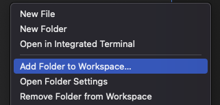

# Development

This page explains step by step how to set up your development environment to debug and develop Robotmk.  
Feel encouraged to contribute code!

## Preconditions

### Docker

A very basic requirement is [Docker](https://www.docker.com) to run the containers.  
On a Mac M1, you probably have to disable the `buildkit` feature:


(Also possible for single build tasks with `export DOCKER_BUILDKIT=0`).

### Visual Studio Code

When you open the Robotmk project for the first time in [Visual Studio Code](https://code.visualstudio.com), you will be prompted to install some extensions - which is highly recommended:


### Chag

Robotmk uses [chag](https://raw.githubusercontent.com/mtdowling/chag/master/install.sh) to keep annotated tags and the CHANGELOG in sync.

Examples:

* Show entries of a special release: `chag contents --tag v1.0.2`
* Create a Changelog entry for the `Unreleased` section: `chag update 1.0.4`
  
### Github CLI tool

Authentication to GitHub is required if you want to release/unrelease.

Install the CLI tools from <https://github.com/cli/cli>.

After installation, authenticate to github. It will ask you about your authentication method, protocol, and present an authentication code which you should open in the opened Github web page.

    gh auth login 

After that you are fully authenticated in the CLI to GitHub.

---

## Development environment setup

Both flavours of Robotmk (CMK1 and 2) can be developed with Visual Studio Code and the [devcontainer setup](https://code.visualstudio.com/docs/remote/containers).

### Build Devcontainer images

Open `.devcontainer/devcontainer_img_versions.env` and add all versions of Checkmk you want to develop on to the `CMKVERSIONS` variable. (= All versions are a long quoted string, separated by newlines.)

Example:

     CMKVERSIONS="1.6.0p29
     2.0.0p22
     2.1.0p4"

After that, run the following command to build the required Docker images:

    .devcontainer/devcontainer_img_build.sh

* First it checks if the CMK Docker images are already available locally. If not, it connects to the [Checkmk Docker Registry](registry.checkmk.com) and downloads the images from there.
* It then creates a new Docker image based on the CMK docker image (downloaded in step 1) and installs some more things (see `.devcontainer/Dockerfile_cmk_py3_dev`):
  * Python modules form `.devcontainer/requirements.txt`
  * some additional tools: `jq tree htop vim git telnet file ...`

For each version you will get an image `cmk-python3-dev:VERSION`.

The Robotmk devcontainers are started based on these images, depending on `${VARIANT}`.
See `.devcontainer/Dockerfile` (which is referenced in `devcontainer.json`):

```
ARG VARIANT``
# Build the dev images with .devcontainer/build-devcontainer.sh !
FROM --platform=linux/amd64 robotmk-cmk-python3:${VARIANT}

```

---

### Generate devcontainer.json

To generate the devcontainer JSON file, execute the following command:

    .devcontainer/devcontainer_gen.sh VERSION

```bash
     bash .devcontainer/devcontainer_gen 2.1.0p16
     + Generating CMK devcontainer file ...
     + Merging local devcontainer file for project robotmk ...
     >>> .devcontainer/devcontainer.json for Checkmk version 2.1.0p16 created.
     Container will start with name: 'robotmk-devc'
```

This reconfigures `.devcontainer/devcontainer.json` using `envsubst` and the template file in `.devcontainer/devcontainer_tpl.json`

### Choose and Start the Checkmk devcontainer

Now it's time to run the container.  

* Run *Cmd-Shift-P* and select `Remote-Containers: Rebuild Container` to start the devcontainer.

In the VS Code terminal you see the CMK site starting.
This takes some minutes (at least on my aged Mac).
During this step, all relevant files for Robotmk get symlinked into the version specific folder of the CMK Docker container.

**Don't try to install the Robotmk MKP into this container! All files are already there!**

The devcontainer is ready now. Open the Checmk login page on <http://127.0.0.1:5000>.

### Select Python Interpreter in VS Code

After the devcontainer has started, you probably have to set the python interpreter in VS Code explicitly.
This is sometimes a little bit unreliable and must be done manually:

* ensure that `settings.json` do not contain a `python.pythonPath` setting anymore
* Open *Cmd-Shift-P* and run "Select Python Interpreter" for the "robotmk" workspace

### Create Dummyhost

* Open <http://127.0.0.1:5000> and log in.
* Create a new user "automation" (Admin), password is to store as plain text.
* Run `.devcontainer/create_dummyhost.sh`:
  * creates a host
  * adds a bakery rule
  * adds a monitoring rule (with graphs for all items)
* Connect to the container as root and execute `bake_and_install_agent_localhost` (bash alias)
  * bake a new agent for the new host
  * install the agent & RObotmk plugin

---

## How to develop

### Develop on the right files

VS code displays by default only the files of the workspace (`/workspaces/robotmk`). They are symlinked to the OMD site, but if you want to debug, you have to add `$OMD_ROOT` as another folder to the workspace:



You can now add breakpoints to the scripts in this folder to debug them.  
Also, only then the code completion (classes, functions, ...) works properly, because it works in the same Python context as Checkmk.

### Debugging Robotmk agent plugins

Debugging `robotmk.py` and `robotmk-runner.py` from the devcontainer is not straightforward, because from the context of the `cmk` user, you are not able to access the Robotmk YML and log files. But it is possible (and very useful), if just do the following steps:

* Open a bash in the container
* Execute as root: `/workspace/robotmk/scripts/docker_fix_agent_permissions.sh`. This script fixes the missing permissions to `/var/log/robotmk` and `/etc/check_mk/robotmk.yml`.

(The required modules for robotmk were installed during `postCreateCommand.sh`)

After that, set a breakpoint in VS Code in `agents_plugins/robotmk-runner.py`. Also select the debugging configuration to "devc V2.x robotmk-runner" and press F5 to start debugging.  

(This step only makes sense if you have already [installed the agent into the container](#install-a-new-linux-agent-in-the-container)).

### Building a MKP inside of the Container

To test how the Github workflow will build MKPs for Robotmk, you can run the build script within the container locally.

In VS Code,

* run command "Tasks chooser: Select Task" => "Build Robotmk MKP"
* run command "Tasks: run task" to execute the build script

*

### Write a changelog

Robotmk's [CHANGELOG.md](CHANGELOG.md) is based on [](https://keepachangelog.com/).

All unreleased work must be documented in `CHANGELOG.md` under the `H2` "Unreleased".  
The second line will be the release title.  
All H3's below shoudl group the changes:

     ## Unreleased

     This will be the release title 

     ### Added
     * this 
     * that 
     ### Changed
     * and this (#66)
     ### Fixed
     * and that (fixes #45)
     ### Removed
     * foo
     ### Deprecated    
     * bar

### Simulating agent output

Agent output (e.g. from a CMK crash dump) can be injected into the container by placing the output as a file in the folder `agent_output`.

Then create a rule `Individual program call instead of agent access` which uses one of the following commands to source the output file instead of using an agent:

     cat ~/var/check_mk/agent_output/$HOSTNAME$
     cat ~/var/check_mk/agent_output/agent_output

### ipdb

`ipdb` is a great cmdline debugger for Python. In the following example it is shown how to execute the Robotmk check within the cmk context.

Install ipdb in the context of the OMD site user:

```
OMD[site]:~$ pip3 install ipdb
Collecting ipdb
  Downloading ipdb-0.13.9.tar.gz (16 kB)
...
```

Example: Debugging the Inventory function with a breakpoint in line 120:  

```
OMD[cmk]:~$ python -m ipdb bin/cmk -IIv test2Win10simdows
> /opt/omd/sites/cmk/bin/cmk(34)<module>()
     33
---> 34 import os
     35 import sys

ipdb> b /omd/sites/cmk/local/share/check_mk/checks/robotmk:120
Breakpoint 1 at /omd/sites/cmk/local/share/check_mk/checks/robotmk:120
ipdb> r
Discovering services on: test2Win10simdows
test2Win10simdows:
+ FETCHING DATA
 [agent] Execute data source
 [piggyback] Execute data source
No piggyback files for 'test2Win10simdows'. Skip processing.
No piggyback files for '192.168.116.8'. Skip processing.
+ EXECUTING DISCOVERY PLUGINS (1751)
ps.perf does not support discovery. Skipping it.
> /omd/sites/cmk/local/share/check_mk/checks/robotmk(120)inventory_robot()
    119 def inventory_robot(robot_items):
1-> 120     robot_service_prefix = get_setting('robot_service_prefix',[])
    121     for robot_item in robot_items:
```

Debugging the bakery:

```
OMD[v1test]:~$ python -m ipdb bin/cmk -Avf win10simdows
> /opt/omd/sites/v1test/bin/cmk(34)<module>()
     33
---> 34 import os
     35 import sys
ipdb> b /omd/sites/v1test/lib/python/cmk_base/cee/agent_bakery.py:85     
```

lib/python3/cmk/base/cee/bakery/agent_bakery.py

### VS Code Build Task

`Ctrl+Shift+B` is bound to `build.sh` which builds the CMK version specific MKP file.

The resulting MKP can be copied to the host system as follows:

```
CONTAINER=a596f322c2e8
cd ~/Downloads
docker exec $CONTAINER bash -c "mkdir -p /cmk-mkp; cp /workspaces/robotmk/*.mkp /cmk-mkp"
docker cp $CONTAINER:/cmk-mkp .
```

---

## How to release

`release.sh` is a helper tool which eases (un)releasing a lot. Sometimes a alpha/beta release should to be withdrawn. With the help of this script and the github CLI tool (authentication required),

### Release

The release workflow of Robotmk is divided into the following steps:

* Make sure that the `develop` branch is clean (=everything is stashed/committed)
* Execute `./release.sh release 1.2.0`, which
  * executes `chag update` => converting unreleased entries in `CHANGELOG` to the new version
  * replaces version number variables in Robotmk script files
  * commits this change as version bump
  * merges `develop` into `master`
  * executes `chag tag --addv` => adds an annotated tag from the Changelog
  * pushes to `master`

### Unrelease

(Unrelease... right. Remove a release from Github - Not at all useless.)

* Execute `./release.sh unrelease 1.2.0`, which
* the release gets deleted from github
* tags are removed
* develop branch gets checked out
* `chag` undoes the last change to the `CHANGELOG`

## File locations

This table shows which folder in the Robotmk project gets mounted where.

Abbreviations:

* `local/share/check_mk` = `l/s/c`
* `local/lib/check_mk/base` = `l/l/c/b`

| Component         | Project folder       | Checkmk folder                               |
| ----------------- | -------------------- | -------------------------------------------- |
| **Agent plugin**  | 📂  `agents_plugins/` | `l/s/c/agents/plugins`                       |
| **Bakery** script | 📂  `bakery/vX/`      | `local/lib/check_mk/base/cee/plugins/bakery` |
| checkman          | 📂  `checkman/`       | `l/s/c/checkman`                             |
| **Checks**        | 📂  `checks/vX/`      | `l/l/c/b/plugins/agent_based`                |
| Images            | 📂  `images/`         | `l/s/c/web/htdocs/images`                    |
| **Metrics, WATO** | 📂  `web_plugins/`    | `l/s/c/web/plugins`                          |
| RF tests          | 📂  `rf_tests/`       | `/usr/lib/check_mk_agent/robot`              |
| Agent output      | 📂  `agent_output/`   | `var/check_mk/agent_output`                  |

## Others

### Bash'ing into the container

VS Code already presents you a bash terminal as user `cmk`.
In Order to open another bash as `root`, just execute `docker exec -it rmk-dev bash`

Inside of the `root` bash, you can also open a preconfigured `tmux` terminal which allows to work with multiple panes.
Shortcuts ("Ca" = Ctrl + a):

* Split horizontaly: `Ca + -`
* Split vertically: `Ca + |`
* Change focus to other pane: `Ca + [arrow]` ([arrow] = Cursor keys)
* Toggle full screen: `Ca + z`
* Toggle Scroll: `Ca + [` => Page up/down => Ctrl+c to quit scrollmode

### Bash conveniences

| user | alias source              | from                         | linked by                    |
| ---- | ------------------------- | ---------------------------- | ---------------------------- |
| cmk  | `$OMD_ROOT/.bash_aliases` | `scripts/.site_bash_aliases` | `.devcontainer/linkfiles.sh` |
| root | `/root/.bash_aliases`     | `scripts/.root_bash_aliases` | `.devcontainer/Dockerfile`   |

### VS Code Conveniences

There are several CMK OMD administration tasks predefined in Tasks Chooeser (extension must be installed).

* reload apache
* inventory and reload core
* restart core

### Troubleshooting

#### Devcontainer does not start

ERROR: The devcontainer does not start; the VS Code `remoteContainers-YYYY-MM-DD` shows:

     [2022-04-01T13:24:30.960Z] [+] Building 2.5s (3/3) FINISHED                                                
     => [internal] load build definition from Dockerfile                       0.1s
     => => transferring dockerfile: 37B                                        0.0s
     => [internal] load .dockerignore                                          0.0s
     => => transferring context: 2B                                            0.0s
     => ERROR [internal] load metadata for docker.io/library/robotmk-cmk-pyth  2.2s
