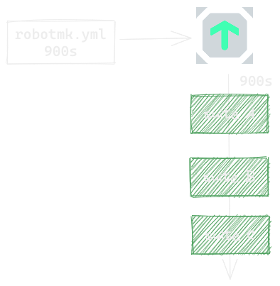
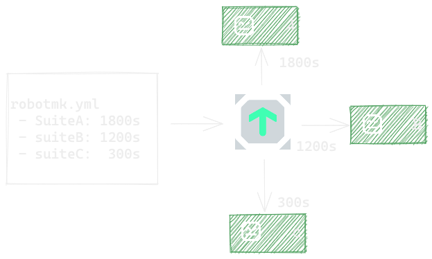

# FAQ

This page contains a list of frequently asked questions (FAQ) as well as explanations for **architectural decisions**. 


## General 

❓ **Question**: The "*Checkmk concept*" is to strictly separate the data collection from the status evaluation. How does Robotmk respect this concept?  
**Answer**:  
Robot Framework is not a tool for pure data collection, but was developed as a *testing* framework. It is in the nature of tests that they produce a result after they have been executed.  
Therefore, on the *testclient* side, the checkmk principle cannot be respected: A test gets the status/result "PASS" if all keywords succeeded; it is "FAIL" if at least one keyword failed. This state is a fact; there is no more detailed evaluation by Robot Framework.  
With Robotmk, the XML file (containing the detailled execution log and final test result) is transferred to the Checkmk server. There, the Robotmk check parses the XML and evaluates tests and keywords.  
This is the *server-side* part, where Robotmk follows the Checkmk concept very well: the Robotmk rules specifically monitor runtimes of tests and keywords. From these results and the client-side determined RobotFramework state Robotmk then determines the overall state ("worst state").  
This is also the reason why the result logged by Robot Framework in the HTML log does not necessarily match the status in Checkmk. Robotmk simply adds another layer to the result of Robot framework.

---

❓ **Question**: Do the HTML log of Robot Framework and the Robotmk services always show the same state/result?  
**Answer**:  
This depends on whether Robotmk monitoring rules exist. If not, the test result corresponds 1:1 to the state displayed in Checkmk.  
But if e.g. a server-side Robotmk keyword runtime mointoring rule exists, it can happen that a "PASS" test result of Robot Framework gets downgraded in Checkmk from "OK" to "CRITICAL". (Robotmk will never *improve* a result). 

---

❓ **Question**: Why is asynchronous plugin execution required for Robotmk?  
**Answer**:  
Of the two plugin execution types, "*synchronous*" and "*asynchronous*", the former is unquestionably ruled out for Robotmk. The reason is that synchronous plugin execution happens in the normal agent interval and is therefore suitable for short-running plugins. Robot tests that operate on user interfaces like a real user tend to be long-running and are therefore unsuitable for synchronous execution. 

---

❓ **Question**: If the Robotmk plugin is executed asynchronously, why is the `<<<robotmk>>>` section missing the execution **timestamp** and **cache time**, (as known from other plugins)?  

**Answer:**:  
This is because Robotmk has its own mechanism for stale detection.  
By default, a plugin (e.g. `check_foo`) executed asynchronously in the interval 900s would normally produce the following section in the agent output: 

```
<<<foo(1658756427,900)>>>
```

Such a section header contains the information that 

* the output for the check "foo" was last executed at "*25 Jul 2022, 15:40:27 CEST*". 
* this result is valid until `1658756427+900=1658757327` ("*25 Jul 2022, 15:55:27 CEST*") and will be used by the checkmk core. If it is too old, it is discarded - with the consequence that the corresponding service changes to "stale" (= obsolete). (can be recognized by the faded color of the last known state). 

A typical Robotmk section does not have a timestamp information in the header; it transports the following JSON payload in v1.x (example):

```
<<<robotmk:sep(0)>>>
{
  "runner": {
    "encoding": "zlib_codec",
    "robotmk_version": "v1.2.1.2",
    "id": "runner",
    "execution_mode": "agent_serial",
    "start_time": "2021-11-04T07:47:03.649123+01:00",
    "end_time": "2021-11-04T07:47:15.985584+01:00",
    "assigned_host": [
      "win10simdows"
    ],
    "runtime_total": 12.336461,
    "runtime_suites": 12.328724,
    "runtime_robotmk": 0.007737000000000549,
    "selective_run": false,
    "cache_time": 180,
    "execution_interval": 120,
    "is_piggyback_result": false
  },
  "suites": [
    {
      "id": "fail1of3",
      "cache_time": 180,
      "execution_interval": 120,
      "path": "fail1of3",
      "tag": null,
      "start_time": "2021-11-04T07:47:03.649123+01:00",
      "htmllog": null,
      "xml": "eNrtG2tz...hfw+mq//ccVFfLuFiD6LP/9EwRGep+xmbFYGNOwUz9nHuTEwTH8Z7/Dzlww1lrwL+Vn5N+Kz+M+Yp8Nqae2lD/PTv4H35WxXA=",
      "end_time": "2021-11-04T07:47:15.977847+01:00",
      "attempts": 2,
      "max_executions": 2,
      "rc": 1,
      "status": "nonfatal"
    }
  ],
  [
    ...suite2
  ]
  ],
  [
    ...suite3
  ]
}

```

Explanation:
* key `runner` = runtime data from `robotmk-runner.py`, which executed the suites in series.
* key `suites` = list of all suite result items. 

The check plugin on the Checkmk server compares the end times of runner and the respective suites and evaluates them as follows: 

* If a single *suite result* is stale, the service(s) go into "stale"; the Robotmk check alerts the (always discovered) service "Robotmk" that the execution of the affected suite obviously failed. 
* If, however, the *runner result* is stale (and consequently all suite results as well, since no suite was executed), the Robotmk check can alert the "Robotmk" service that there is a fundamental problem with the scheduling of the runner. 

In conclusion, if Robotmk would rely on Checkmk's stale mechanism and transport a timestamp/cache in its header, the CMK core would **directly discard outdated results**.  
The Robotmk check would never know that there are stale services, which must be given to the the *Robotmk* service in the GUI. 

---

❓ **Question**: Why are there 2 different Robotmk plugins? Why isn't there only *one* `robotmk.py` agent plugin?  
**Answer:**  
`robotmk-runner.py` is the plugin which actually executes the Robot Framework tests (serially). This can take a lot of time and is not feasable by a synchronous plugin (which gets started every minute). For this reason, the runner plugin does not produce any output, but generates JSON result files after each Robot execution.  
`robotmk.py` gets executed synchronously and is only responsible to generate agent compatible output from all the JSON result files (written by the runner plugin). 

---

❓ **Question**: Why doesn't Robotmk just use the **asynchronous plugin execution** for every suite? This would allow parallel execution by nature, done directly from the agent?  
**Answer 1:**  
There is no way for the agent to execute `robotmk-runner.py --suite A` and another time `robotmk-runner.py --suite A` (agent plugins cannot be parametrized). 
The only way to call one and the same agent plugin with different intervals and parameters would be to deploy it multiple times and to store the name of the Robot suite to be started in the plugin name (e.g. `robotmk-runner-suiteA.py / robotmk-runner-suiteB.py, ...`). Using the suite name, the plugin could then read further parameters from the config.  
But this looks rather clumsy and leads to duplicated code.  
**Answer 2:**  
Assuming there was a way (as in answer 1) to start the suites as individual plugins from the agent, another problem would arise (which already shows up in Robotmk 1.x today):  
The Checkmk agent keeps track of the threads started per plugin - and allows only one instance of each.  If a plugin runs longer than its `cache_time` (=execution interval), the Checkmk agent refuses to start a second thread:

    [srv 6720] restarted thread for plugin 'C:\ProgramData\checkmk\agent\plugins\robotmk-runner.py'
    ...
    [srv 6720] restarting async plugin 'C:\ProgramData\checkmk\agent\plugins\robotmk-runner.py'
    [srv 6720] Thread for plugin 'C:\ProgramData\checkmk\agent\plugins\robotmk-runner.py' is still running, restart is not required

The consequence is that the execution of an End2End test no longer takes place in the cycle as planned - even worse: as possibly contractually agreed with customers.  
A (supposed) workaround is to specify a `timeout`, which ensures that the runtime of a thread cannot go beyond the execution interval by killing the thread: 

```yaml
plugins:
  enabled: true
  execution:
  - cache_age: 600
    pattern: $CUSTOM_PLUGINS_PATH$\robotmk-runner.py
    timeout: 550
```

However, a prematurely killed Robotmk plugin thread can never save its results.  
From the point of view of the Checkmk monitoring, the robot test therefore also never runs.  
(Already today in Robotmk v1.x the execution interval must be chosen thoroughly, that it is always sufficiently higher than the sum of all suite runtimes (serial execution!). Otherwise the agent clears the thread and results are lost).  

---

❓ **Question:**  What happens if the (asynchronous) execution of Robotmk (with all suites) takes so long that the next execution step would already be ready? What is the solution for this problem?  
**Answer:**  
As explained in '*Why doesn't Robotmk just use the asynchronous plugin execution*', in this case the Checkmk agent kills the execution of the Robotmk thread. The result of the suite currently executed by Robotmk, as well as the runner itself, will be lost. 

The problem is made worse by the fact that each `n` second deviation in the suite runtime shifts the execution slots of all subsequent suites backward by `n` seconds as well. The further back in the chain a suite is scheduled, the less predictable its start time, the greater the risk of being killed by the agent:



The requirements to solve the problem: 

- if the client's resources allow it: the suites must be reliably started at their interval (overlaps should be tolerated)
- report to the *robotmk* service when
  - two executions of suites overlap (=> "*adjust execution interval*")
  - suite results become stale because 
    - starting another suite instance was prevented due to CPU/RAM (=> "*SuiteA not started; not enough resources available*")      
    - Robotmk had to kill a suite because of `hard_timeout`. This should be: `execution_interval * 2 - 10s`.
  


