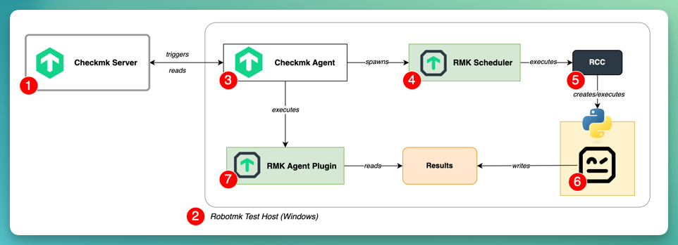
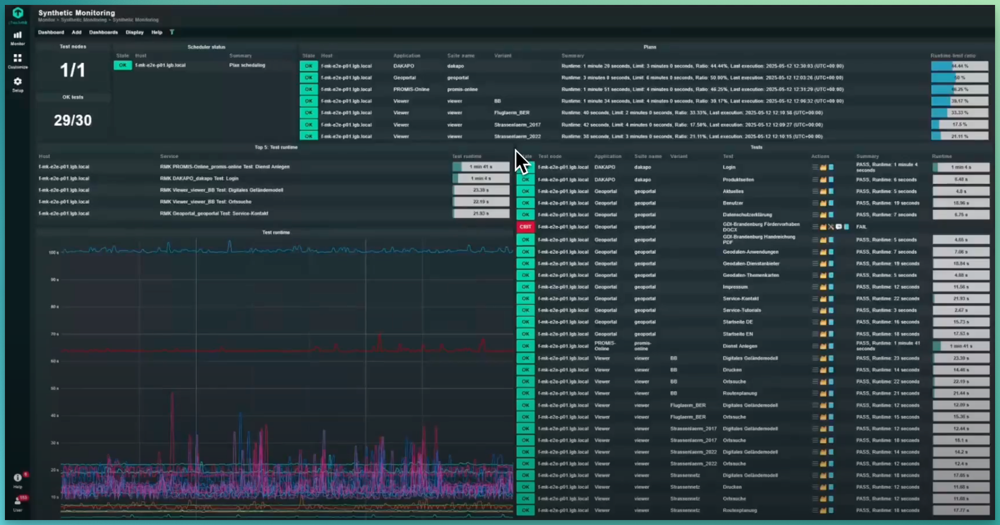
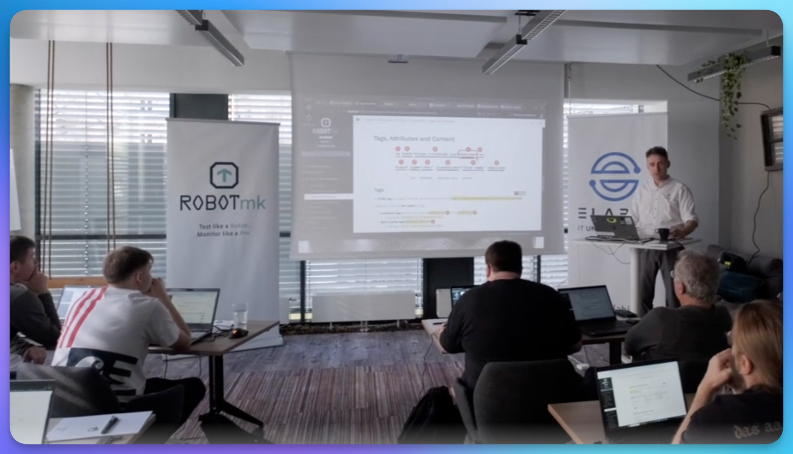

# Robotmk

## 🚀 What is Robotmk?

**Robotmk** is the **bridge technology** between the testing tool [Robot Framework](https://robotframework.org) and [Checkmk](https://checkmk.com).  

Robotmk lets you run **Robot Framework** test cases periodically on test hosts to simulate arbitrary user actions on any interface: Web UIs, Desktop applications, REST APIs, databases, ...  

It integrates these results into Checkmk services, giving you unprecedented visibility into the **availability**, **performance**, and **functionality** of your business applications - all this under a single monitoring interface: Checkmk.

It was developed during the pandemic 2020 by Simon Meggle as an "MKP" extension (Checkmk plugin package) and became quickly the most downloaded package on the [Checkmk Exchange platform](https://exchange.checkmk.com).  

Since Checkmk 2.3, it is a **natively integrated feature** in Checkmk, now also called **[Synthetic Monitoring](https://checkmk.com/product/synthetic-monitoring)**.

---

## The two flavors of Robotmk

### 1. ✅ Integrated into Checkmk (since 2.3)

The <mark>recommended and actively maintained</mark> version is built into Checkmk under the name **[Synthetic Monitoring](https://checkmk.com/product/synthetic-monitoring).**

It can be used free of charge for **up to 3 test services** and **up to 15 keywords**.

**Architecture:**

1. **Checkmk Server**: At least **version 2.3** is required as a Checkmk server (Cloud or MSP version).  
Robotmk is not compatible with the RAW edition of Checkmk.
1. Robotmk **test hosts**: Windows or Linux hosts on which the Robot Framework suites are to be executed by Robotmk.  
2. **Checkmk Agent**: supplemented in the Checkmk Agent Bakery with both the Robotmk Scheduler and the Agent Plugin, as well as the configuration file.
3. **Robotmk Scheduler**: Spawned and supervised as a permanent subprocess of the Checkmk Agent ("*extension*").  
Responsible for the parallel execution of Robot Framework plans in their individual intervals.
1. **RCC**: A command line tool which the scheduler uses to build individual Python environments for the individual suites.  
This allows to run an arbitrary number of test suites with completely different dependencies (Python, Nodejs, ...) without interferences.
1. **Robot Framework Suites**: The scheduler executes these robot suites in the respective environments and pre-processes the results for the agent plugin.
2. **Robotmk Agent Plugin**: similar to all other CMK agent plugins, this Plugin is called at the regular interval (1 minute).  
It reads the last result of all Suite executions and uses it to build the Robotmk sections for the agent output.

*(Robotmk Dashboard, with kind permission from LGB, Landesvermessung und Geobasisinformation Brandenburg)*  

---

### 2. 📦 MKP Version (legacy)

The older MKP-based version is still available for Checkmk versions **2.3 and 2.4** and can be downloaded from the [Checkmk Exchange](https://exchange.checkmk.com/p/robotmk).

⚠️ **Notice:** The MKP version will no longer be updated or maintained starting with Checkmk **2.5**.

---

## Learn & Explore

- **Synthetic Monitoring Product Page** - Official Homepage of the Synthetic Monitoring Product of Checkmk  
  https://checkmk.com/product/synthetic-monitoring
- **Checkmk Synthetic Monitoring Documentation**  
  https://docs.checkmk.com/latest/en/synthetic_monitoring.html
- **Robotmk Homepage, Blog & Training** - Tutorials, technical articles and the Synthetic Monitoring training:  
  [https://robotmk.org](https://robotmk.org)
- **Examples Repository** - Curated test cases and templates:  
  [Robotmk Examples on GitHub](https://github.com/Checkmk/robotmk-examples)
- **Robot Framework** - Learn more about the testing framework that powers Robotmk:  
  [https://robotframework.org](https://robotframework.org)
- **Robot Framework User Guide** - Official Documentation  
  https://robotframework.org/robotframework/latest/RobotFrameworkUserGuide.html

---

## 🎥 Talks & Presentations

| Title                                             | Notes                                                                                                                                   | Event                         | Link                                        |
| ------------------------------------------------- | --------------------------------------------------------------------------------------------------------------------------------------- | ----------------------------- | ------------------------------------------- |
| **Test like a Robot, Monitor like a Bavarian**    | A talk of **Sebstian Böhm** and **Maxi Sachmann** from the **City of Munich**                                                           | Checkmk Conference #11 (2025) | https://youtu.be/dseJ9iLrzYI?t=7801         |
| **What's new in Synthetic Monitoring in CMK 2.4** | **Jörg Herbel** and **Simon Meggle**                                                                                                    | Checkmk Conference #11 (2025) | https://youtu.be/dseJ9iLrzYI?t=16019        |
| **Synthetic Monitoring of Geomap Applications**   | **Simon Meggle** giving technical insights into a Robotmk customer project at LGB, Landesvermessung und Geobasisinformation Brandenburg | Checkmk Conference #11 (2025) | https://youtu.be/dseJ9iLrzYI?t=17339        |
| **Getting Started with Synthetic Monitoring**     | Part 1                                                                                                                                  | Checkmk Youtube Channel       | https://www.youtube.com/watch?v=1Ec8QwaJWXU |
| Integrating Robot Framework tests in Checkmk      | Part 2                                                                                                                                  | Checkmk Youtube Channel       | https://www.youtube.com/watch?v=peo9SgN5ciY  |

---

## Training

Get trained by **Simon Meggle**, the original **creator of Robotmk** and Product Manager of Checkmk Synthetic Monitoring.  

In collaboration with Elabit GmbH and Checkmk, this comprehensive **4-day training** is designed to take you from fundamentals to expert-level understanding of end-to-end monitoring with Robot Framework.

**Training Highlights:**

- ✅ Robot Framework Fundamentals (= covering the preparation for the exam [Robot Framework Certified Professional (RFCP)](https://cert.robotframework.org))
- ✅ Handling Python Runtime Environments
- ✅ Writing robust CSS/XPath selectors
- ✅ Web testing with the Browser Library (Playwright)
- ✅ Successful testing of Desktop applications
- ✅ Robotmk: Integration of Robot Framework into Checkmk  

Check training dates and availability soon here: 👉 https://checkmk.com/trainings/schedule

