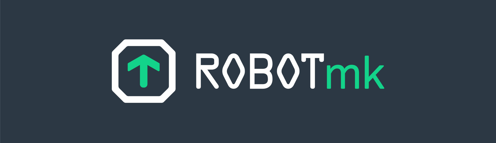

# Robotmk

Welcome to Robotmk!

Important information: 
- 🏗 This is the development branch for Robotmk V2 - not yet meant for production
- Robotmk v1 will be phased out in 2024 due to a complete rewrite in collaboration with [Checkmk GmbH](https:/checkmk.com).
- The current stable version of Robotmk v1 for Checkmk 2.2 can be downloaded as an MKP in the [release section](https://github.com/elabit/robotmk/releases)
- Meanwhile you can sign up for the [Robotmk Academy](https://www.robotmk.org): At the end of 2023 you will find there a **three-part course** system, in which I will impart my project experience and best practices from **10 years of End2End monitoring**, including an official certificate of participation.  
**Be curious** and [register](https://www.robotmk.org) today!  🤖

---

Be patient - in **spring 2024** Checkmk 2.3 will be released and will **include Robotmk**.  
This new feature will be available under the name **"Synthetic Monitoring for Checkmk"**. 
We are working hard on it - let the robots in!   🤖

See my presentation at the Checkmk Conference #9 (2023) to learn what we and the "Team Robot" are working on: 

Simon Meggle at the Checkmk Conference 2023 -  Synthetic Monitoring in 2.3
