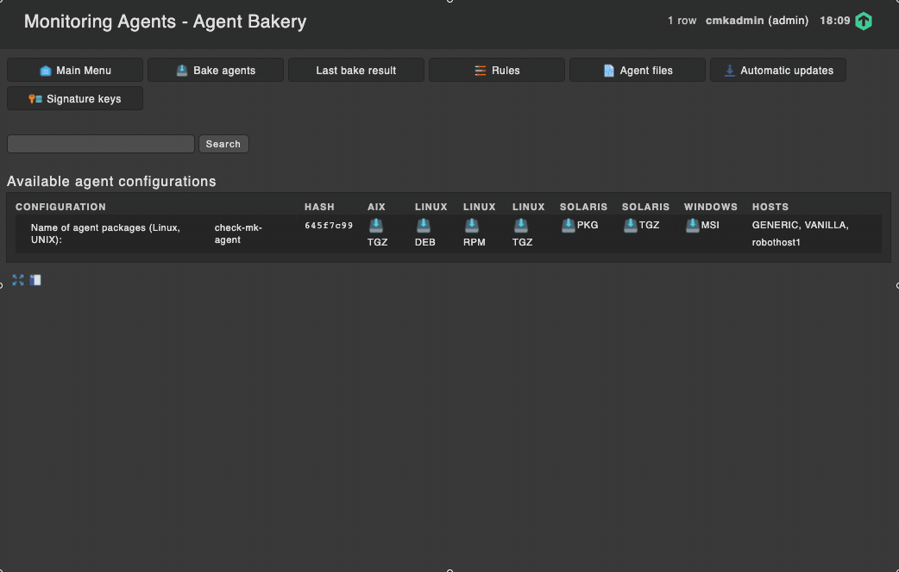
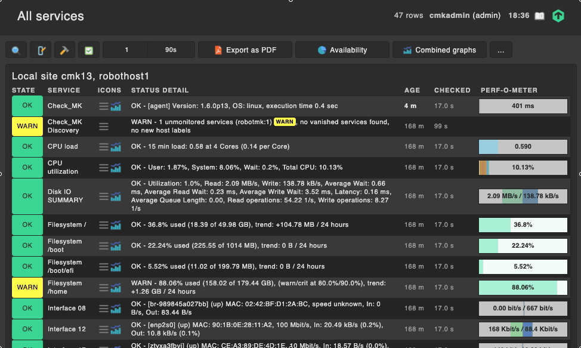

# RobotMK

*A tool to integrate Robot Framework End2End tests into CheckMK*

[](https://travis-ci.com/simonmeggle/robotmk)


## Description

**What is RobotMK?** RobotMK allows you to integrate the results of the great [Robot Framework](https://robotframework.org/) into the great monitoring system [CheckMK](https://checkmk.com). Great. 

**Why do you need RobotMK?** A monitoring system like checkMK does a very good job to monitor your business' IT infrastructure with checks for CPU, Memory, Network devices, etc. The reason why you are running IT is that you provide a service to users. Therefore you also should monitor what your users use, and most important: do it like they do. Use a real browser, mouse and keyboard strokes. Test from End (the user) to End (your IT infrastructure as a whole). This is called "End2End"-Testing.

Robot Framework can automate End2End-Tests for you (and much more). Integrating those tests into CheckMK is a great supplement.

**RobotMK** acts as a bridge between Robot Framework and CheckMK. It consists of those components: 

* RobotMK **bakery rule**: Use the CheckMK WATO rule editor to decide which remote hosts should be deployed with the RobotMK plugin. Define which suites should be executed there and the individual parameters. 
* RobotMK **plugin**: integrated into the CheckMK monitoring agent, it executes Robot tests on the client side. It gets controlled by the robotmk YML file which is created by the bakery. 
* RobotMK **check**: evaluates the Result coming from Robot tests. Define thresholds for any step within the test. Control which steps should produce performance data for nice graphs. Decide how to split up Robot results into different services ("checks" in CheckMK) - without splitting the robot test. 

Read the [feature page](https://robotmk.org) of RobotMK to learn about its history, features and advantages. 

## Key features

* **Centralized control** via WATO: RobotMK is configured via a powerful rule system in the web administration interface of CheckMK (WATO).
* **100% Robot-compatible**: RobotMK does not require any adaptation to existing Robot tests; they can be integrated in CheckMK without any intervention.
* **Runtime monitoring**: ​RobotMK monitors the runtimes of whole suites, tests and keywords assisted by the pattern-based rule system. Even insidious performance changes can thus be detected.
* **Pattern-based reduction of the output** to the essential ensures an optimum result.
* selective **performance data**: granular control over the creation of performance graphs

## Requirements

CheckMK 1.6 Enterprise edition (CEE) is recommended to distribute the RobotMK YAML configuration to the monitoring agent. If you are using CRE, consider a worthwile [switch to CEE](https://www.iteratio.com/). 

If you a fine to write the YAML configuration by hand, CRE is also appropriate. 

## Installation

You can choose between two ways of installing RobotMK: 

* by hand (cloning the repository, coping files by hand)
* Installing as [MKP](https://checkmk.com/cms_mkps.html) from [CMK Exchange](https://exchange.checkmk.com/) (recommended)


Now verify that checkMK can use the robotmk check: 

```
$ su - cmk
OMD[cmk]:~$ cmk -L | grep robot                                          
robotmk     tcp    (no man page present)
```

## Usage

### Configure what to execute

This recording shows how easy it is to deploy the RobotMK to the host `robothost1`: 

* Go to the WATO section "Monitoring Agents" -> Rules
* Create a new "RobotMK" rule
  * We set the Cache time to 5 minutes so that the plugin gets executed only every 5 minutes.  
  * `sampletest` is the name of a Robot test in the default agent lib folder (`/usr/lib/check_mk_agent/robot`, configurable). To bring Robot test to the client, use the WATO rule `Deploy custom files with agent` - but there is more to come :-)  
  * As you can see, we can set most of the arguments we could also give to Robot on the CLI: rename the suite, pass variables, call variable files with parameters (yeah), etc...
  * Piggyback allows you to assign the Robot result to another host than `robothost1`




* The bakery bakes a new RPM package containing the RobotMK plugin and the RobotMK YML file: 

```
# Created by Check_MK Agent Bakery.
# This file is managed via WATO, do not edit manually or you
# lose your changes next time when you update the agent.

cache_time: 300
console: ''
log: ''
report: ''
robotdir: /usr/lib/check_mk_agent/robot
suites:
  sampletest:
    name: iwantanothername
    variablefile:
    - varfile.py:testing
    variables:
    - var1:value1
    - var2:value2
```
### Integrate the new Robot E2E check into CheckMK

As soon as the new agent is installed on the client, it starts to execute the robot test(s). You will notice that the service "CheckMK Discovery" turns to WARNING because it hs found the first result of out Robot test in the agent output. Let's integrate the new check into the monitoring!



### Configure the E2E check

Lastly, we want to 

* set a threshold on `Subsuite3` on 5 seconds
* draw performance data for every `Subsuite`


## Development setup

### Installation 

It is assumed that you are developing on a Linux host which already has CheckMK installed. Instead of copying the files into the site (as described in [Installation](#installation)), just create symlinks (`ln -s `) to the apropriate files and directories. 

### Python versions
This project is based on two Python versions: 

* **Python 2.7** - robotmk **check** on the CheckMK Server (CheckMK will be running soon on Python3)
* **Python 3.6** - robotmk **plugin** on the Robot test host

To run all tests, make sure that you have installed both versions on your machine. 

### tox 

[tox](https://tox.readthedocs.io/en/latest/index.html) manages the virtual envs for us to run tests both for check and plugin within their proper environment. 

First, make sure that you have `tox` installed on your system. It is perfect to install tox in a virtual environment: 

```
~$ virtualenv ~/venv-tox
created virtual environment CPython2.7.5.final.0-64 in 140ms
  creator CPython2Posix(dest=/root/venv-tox, clear=False, global=False)
  seeder FromAppData(download=False, pip=latest, setuptools=latest, wheel=latest, via=copy, app_data_dir=/root/.local/share/virtualenv/seed-app-data/v1.0.1)
  activators PythonActivator,CShellActivator,FishActivator,PowerShellActivator,BashActivator
~$ . ~/venv-tox/bin/activate
(venv-tox) ~$ pip install tox
(venv-tox) ~$ tox --version
3.15.1 imported from /root/venv-tox/lib/python2.7/site-packages/tox/__init__.pyc
```

### running tests with tox

With `tox` installed now, the tests can be started: 

```
# run tests for the plugin (Python 3.6) and the check (Python 2.7)
tox
# run only plugin tests
tox -e plugin 
# run only check tests
tox -e check
```

### Submodule init

All tests rely on the Python test module [python-pytest-check_mk](https://github.com/tom-mi/python-pytest-check_mk), for which two pull requests are waiting. 

As long as the pull reqeusts ([1](https://github.com/tom-mi/python-pytest-check_mk/pull/1) and [2](https://github.com/tom-mi/python-pytest-check_mk/pull/2))  are outstanding, the forked version of `python-pytest-check_mk` is included as a git submodule. `tox` (see next section) takes care about the initialisation, so there is no work for you. 

The manual step to update the submodule is: 
``` 
git submodule update --init --recursive
```

## License

**RobotMK** is published unter the [GNU General Public License v3.0](https://spdx.org/licenses/GPL-3.0-or-later.html)

## Credits/Thanks

### Contributions

I want to express my thanks to the following people who help to make RobotMK better by submitting code: 

* Michael FRANK (contributed to the agent plugin)
* Guillaume DURVILLE (contributed to the bakery rule)

### Supporters

Thanks to the companies which support the development of RobotMK: 

* [ITERATIO GmbH](http://iteratio.com/), Cologne - Hardy DÜTTMANN
* 
