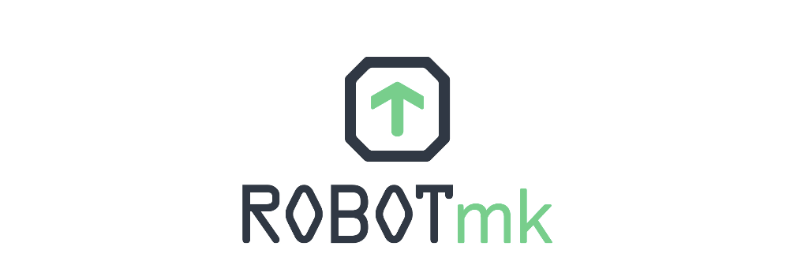
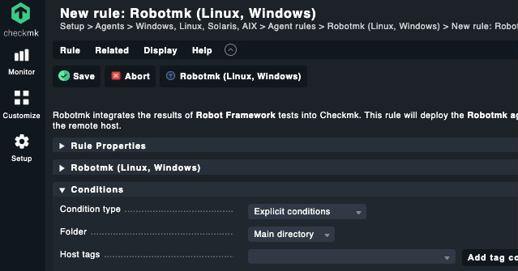
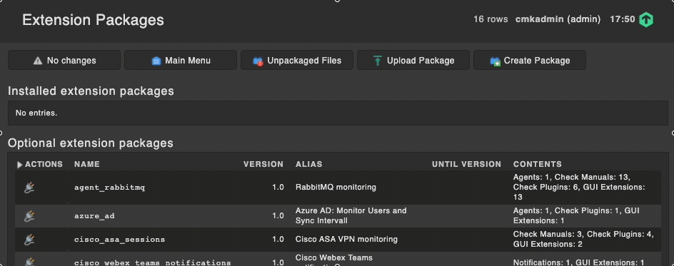
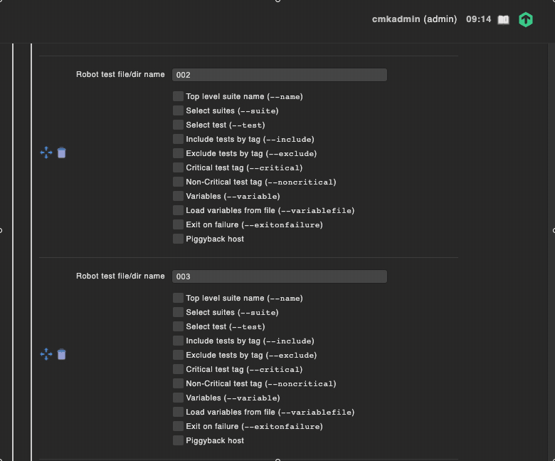

# Robotmk
<!-- ALL-CONTRIBUTORS-BADGE:START - Do not remove or modify this section -->
[](#contributors-)
<!-- ALL-CONTRIBUTORS-BADGE:END -->

*A complete solution to integrate **Robot Framework** End2End tests into **Checkmk***

<!-- [](https://travis-ci.com/simonmeggle/robotmk)  -->

[](https://github.com/simonmeggle/robotmk/actions/workflows/markdown-toc.yml) [](https://github.com/simonmeggle/robotmk/actions/workflows/mkp-release.yml)


<!--ts-->
- [Robotmk](#robotmk)
  - [Description](#description)
  - [State of development](#state-of-development)
  - [Key features/components](#key-featurescomponents)
  - [Usage scenarios](#usage-scenarios)
  - [Requirements](#requirements)
  - [Installation](#installation)
  - [Documentation](#documentation)
    - [`robotmk.yml` explained](#robotmkyml-explained)
  - [Next developments](#next-developments)
  - [Contributing](#contributing)
  - [License](#license)
  - [Credits/Thanks](#creditsthanks)
    - [Supporters](#supporters)
  - [Contributors ✨](#contributors-)

<!-- Added by: runner, at: Sun Jul 25 08:41:08 UTC 2021 -->

<!--te-->

## Description

**What is Robotmk?** 

`"Robot Framework + Checkmk = Robotmk"`

* [Robot Framework](https://robotframework.org/) is a generic testing framework. It can test any kind of application with the help of *libraries*. 
* [Checkmk](https://checkmk.com) is a state-of-the-art IT infrastructure monitoring system. 
* **Robotmk** integrates the results of Robot Framework into Checkmk. It bridges the gap between infrastructure and application testing. 

**The purpose of Robotmk** 

Business applications have to be **available, performant** and **functioning**. 

A monitoring system like Checkmk does a very good job to monitor your business' IT infrastructure with checks for Servers, Network devices, etc. 

But in the end - the reason why you are running IT is to *provide a service* to users. 

Therefore you shouldn't only monitor infrastructure, but also *the services*. And most important: do it like *they* do: Use a real browser, mouse and keyboard strokes. Test from End (the user) to End (your IT infrastructure as a whole). This is called **"End2End"-Testing**.

**Robot Framework** can automate End2End-Tests for you (and much more). 
Integrating those tests into **Checkmk** is a great supplement.
**Robotmk** acts as a bridge between **Robot Framework** and **Checkmk**. 

## Key features/components

The Robotmk project consists of different components working together: 

* Robotmk **WATO pages** for 100% configuration via the checkmk web UI
* Robotmk **bakery rule** - configures E2E clients:
  * Use the Checkmk WATO rule editor to decide which remote hosts should be deployed with the Robotmk plugin.
  * Define which suites should be executed on the test host
  * Parametrize the Robot tests with commandline options of Robot Framework - no CLI needed. 
  * Let Robot Framework repeat failed tests for certain number of attempts. This is a very useful and outstanding feature to get more stable results if the SUT behaves unconsistently. 
* Robotmk **plugins** - executes RF tests: 
  * the `robotmk-runner` is a kind of wrapper for RF tests on the client side. It gets controlled by the robotmk YML file which is created by the bakery. 
  * the `robotmk` plugin is executed as a normal plugin and reads the results written by the runner plugin.
* Robotmk **check** - evaluates RF results:
  * evaluates the RF result coming from the Checkmk agent. 
  * 100% configurable by web (WATO), 100% Robot compatible: Robotmk does not require any adaptation to existing Robot tests; they can be integrated in Checkmk without any intervention.
  * powerful pattern-based definition system for "most general" and/or fine granular control of
    * runtime thresholds: get alarms for suites/tests/keywords running too long. 
    * performance data: get graphs for any runtime. Even insidious performance changes can thus be detected.
    * service discovery level: rule-based splitting of Robot Framework results into different Checkmk services ("checks" in Checkmk) - without splitting the robot test. 
    * reduction of the output to the essential needs for an optimum result.
    * (new) log integration: The check extracts the Robot HTML logs and integrates 
      them into the Checkmk web UI: 



*The integration of Robot HTML logs into Checkmk makes it easy to understand why an E2E test failed*

* [Robotmk Keyword Library](https://pypi.org/project/robotframework-robotmk/):
  * Set custom monitoring states
  * Add monitoring metrics
  * Add custom performance data

Read the [feature page](https://robotmk.org) of Robotmk to learn about its history, features and advantages. 

## Usage scenarios

**Robotmk** is great for: 

* having both monitoring business-critical applications and infrastructure check within the same monitoring tool (Checkmk)
* monitoring modern apps: Angular, React, Android/iOS based, ... Robot Framework has a long list of well-curated libraries
* monitoring old legacy apps: even the oldest applications can be monitored with Robot Framework by using a image recognition based library. 
* monitoring 3rd party services: there are bunch of libraries to write tests based on REST, SOAP, TCP sockets, SSH, FTP, ...  
* **Monitoring business relevant services** to save time, cost and revenue. 

## State of development

**Is Robotmk stable? Can it be used in production?**

Fortunately, the development of Robotmk is driven by customers who believe in the project and use it already in their daily business. This is where worthful feedback and feature requests come from. 

As bugs are getting solved and new features are coming in, there is no guarantee that after installing a new version of Robotmk settings, output formats etc. will be the same or at least compatible with the previous version. We try to communicate this in the [CHANGELOG](./CHANGELOG.md) as detailled as possible. 

Incompatibilities will always be reflected in a major version change. As soon as the major version number is not changing, chances are good that all existing CMK rules for Robotmk will work.  

Remark to the current version 1.2: although this version will break existing WATO rules for a very last time (see #164) this is not a major release.

## Requirements

Robotmk works with any Checkmk 1.6x and 2.x version and edition (CEE and CRE).

* Enterprise edition (CEE) is recommended if you want to benefit from the agent bakery system which creates agent installation packages and the Robotmk YAML configuration files. 
* Raw Edition (CRE) also works if you are fine to write this files by hand/generate by some other tool (Ansible etc.). (Nevertheless, consider a worthwile [switch to CEE](https://www.iteratio.com/))

## Installation

You can choose between two ways of installing Robotmk: 

* Installing as [MKP](https://checkmk.com/cms_mkps.html) is the preferred way. 
  * The most recent release can be downloaded here on the [Releases](https://github.com/simonmeggle/robotmk/releases) page
  * The latest MKP *reviewed by tribe29* (the Checkmk guys) can be fetched from [CMK Exchange](https://exchange.checkmk.com/) (not always up to date)
* Installation by hand is only recommended for advanced users who love to get dirty hands. 




Now verify that checkMK can use the robotmk check: 

```
$ su - cmk
OMD[cmk]:~$ cmk -L | grep robot                                          
robotmk     tcp    (no man page present)
```

In a distributed monitoring environment, make sure to check the option `Replicate extensions` in the remote site's connection options. 

## Documentation

All Robotmk rules come with a very **detailled and comprehensive context help**. This covers 95% of all information which is needed to work with Robotmk. 

The context help can be shown by clicking on the **book icon** in the top right corner of every Robotmk rule:  



## Learning Resources

You can find comprehensive learning material to teach you the best practices in End2End monitoring with Checkmk and Robotmk on [the Robotmk Academy](https://www.robotmk.org).

Registration is free and includes three basic course which show the fundamentals of Robotmk. 

Further learning course material is in preparation for 

* Containerized E2E testing with Docker Swarm/Kubernetes/OpenShift
* Best practices ofr using libraries like SeleniumLibrary, Playwright, CryptoLibrary etc.
* fully automated Python environment rollouts with RCC
* Using Robocorp with Robotmk 
* and much more. 

## Professional Support

Need the help of an Expert? Save your time.

No matter at which stage you are with Robot Framework and Robotmk: there are [experienced professionals](https://www.robotmk.org/pages/professionalsupport) who can assist you with: 

* Robotmk best practice for the optimal usage of Robot Framework together with Checkmk * monitoring
* Implementation
* Know-how: all partners are up to date with recent developments and features
* Deep knowledge of configuration tools like Saltstack, Ansible etc. to implement a fully * automated deployment of Robotmk, Robot Framework, Libraries and test code.
* Checkmk best practice

## Next developments

See the [Github Issues](https://github.com/simonmeggle/robotmk/issues) page for a complete list of feature requests, known bugs etc.

Next development steps will be: 

* Development of a Robotmk Docker container
* Implementation of a Robotmk special agent for Kubernetes/Docker Swarm environments  
* Implementation of a Robotmk special agent for Robocorp Cloud
* Integrate RCC from the [Robocorp toolchain](https://robocorp.com/docs/rcc/overview) to make Python environments portable. 

## Contributing

If you want to help Robotmk to get better, you're warmly welcomed!

* Fork this project
* Create a feature branch with a name containing the issue number (or submit a new issue first), from the current `develop` branch. 
* Always and often rebase your feature branch from `develop` 
* Pull requests are welcome if they can be merged and solve a problem

## License

**Robotmk** is published unter the [GNU General Public License v3.0](https://spdx.org/licenses/GPL-3.0-or-later.html)

## Credits/Thanks

### Supporters

Thanks to the companies which support the development of Robotmk: 

* [Abraxas Informatik AG](https://www.abraxas.ch/), St. Gallen (CH) -  Jens Dunkelberg
* [ITERATIO GmbH](http://iteratio.com/), Cologne (GER) - Hardy Düttmann
* [comNET GmbH](https://www.comnetgmbh.com), Hannover (GER) - Thorben Söhl

## Contributors ✨

Thanks goes to these wonderful people ([emoji key](https://allcontributors.org/docs/en/emoji-key)):

<!-- ALL-CONTRIBUTORS-LIST:START - Do not remove or modify this section -->
<!-- prettier-ignore-start -->
<!-- markdownlint-disable -->
<table>
  <tr>
    <td align="center"><a href="http://kleinski.de"><br /><sub><b>Marcus Klein</b></sub></a><br /><a href="https://github.com/simonmeggle/robotmk/issues?q=author%3Akleinski" title="Bug reports">🐛</a></td>
    <td align="center"><a href="https://burntfen.com"><br /><sub><b>Richard Littauer</b></sub></a><br /><a href="#mentoring-RichardLitt" title="Mentoring">🧑‍🏫</a></td>
    <td align="center"><a href="https://github.com/a-lohmann"><br /><sub><b>A. Lohmann</b></sub></a><br /><a href="https://github.com/simonmeggle/robotmk/issues?q=author%3Aa-lohmann" title="Bug reports">🐛</a></td>
    <td align="center"><a href="https://github.com/NimVek"><br /><sub><b>NimVek</b></sub></a><br /><a href="https://github.com/simonmeggle/robotmk/issues?q=author%3ANimVek" title="Bug reports">🐛</a></td>
  </tr>
</table>

<!-- markdownlint-restore -->
<!-- prettier-ignore-end -->

<!-- ALL-CONTRIBUTORS-LIST:END -->

This project follows the [all-contributors](https://github.com/all-contributors/all-contributors) specification. Contributions of any kind welcome!